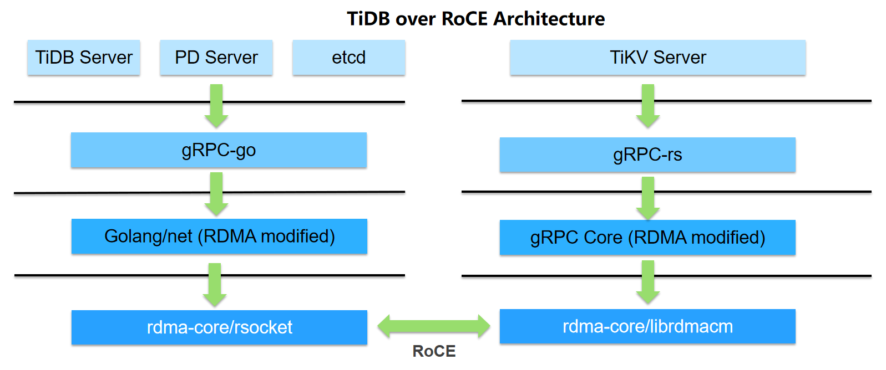

# TiDB-over-RoCE Project

This project proposes running TiDB over RoCE protocol, which means commucations between TiDB sever, pd and TiKV can benefit from RDMA technology, and higher performance and lower CPU workload are expected.

## Architecture

## Community, discussion, contribution, and support

Learn how to engage with the PingCAP community on the [community page](https://github.com/pingcap/community) and TiKV community on the [TiKV community page](https://github.com/tikv/community).

You can reach the maintainers of this project at:

- [Slack: tidbcommunity](https://tidbcommunity.slack.com/)

### Code of conduct

Participation in the PingCAP community is governed by the [Code of Conduct](code-of-conduct.md).
