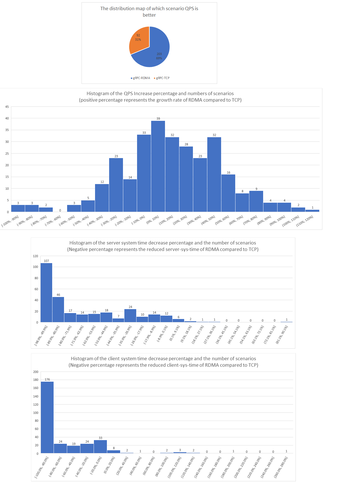
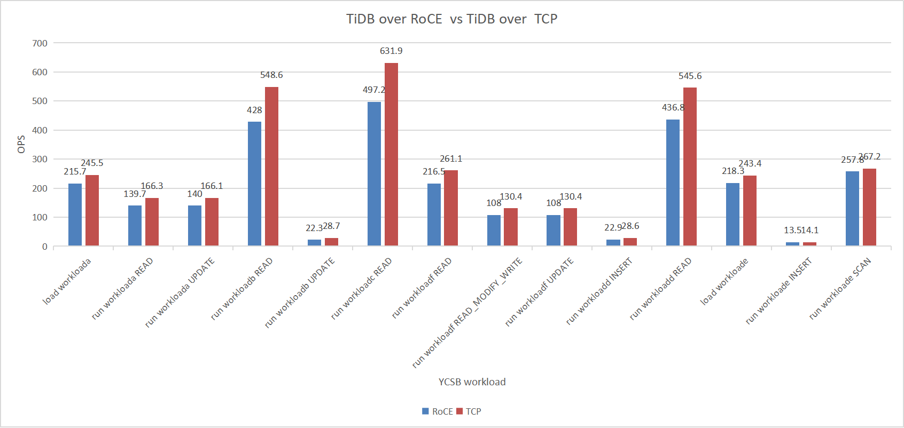

# TiDB-over-RoCE Project

This project proposes running TiDB over RoCE protocol, which means commucations between TiDB sever, pd and TiKV can benefit from RDMA technology, and higher performance and lower CPU workload are expected.

## Architecture

### Design for go-rdma

TODO
### Design for grpc-rdma

TODO

## Performance

### gRPC

The benchmark test based on [gRPC performance test](https://github.com/grpc/grpc/tree/master/tools/run_tests/performance)

Fig1 depicts the percentage and number of gRPC-TCP and gRPC-RDMA that are dominant in QPS in 295 benchmark scenarios.

Fig2 depicts the QPS increase percentage and numbers of scenarios using gRPC-RDMA compared to gRPC-TCP.
e.g.[10%, 20%] means there are 32 scenarios(total 295) where the qps growth distributed in this range using gRPC-RDMA compared to gRPC-TCP.

Fig3 and Fig4 depicts the client/server system time decrease percentage and the number of scenarios using gRPC-RDMA compared to gRPC-TCP.
e.g.Fig3 [-98.9%, -89.9%] means there are 107 scenarios(total 295), the increase of server system time(negative means optimization) is distributed in this interval.

### YCSB Workloads

YCSB workloads test based on [go-ycsb](https://github.com/pingcap/go-ycsb)

## Steps to use

### TiDB\PD (or any other Go projects like go-mysql-client and ycsb-go)

1. Download all directories in this resposity

2. Set GOROOT to the go-rdma path, build golang binary using `./make.bash` in `go-rdma/src/`

3. Compile rdma-core library using `./build.sh` in `rdma-core` path, and make sure the library path in top of [go-rdma/src/rdma/fd_unix.go](./go-rdma/src/rdma/fd_unix.go) is consistent with your rdma-core path

4. Compile TiDB and PD, then the executable file (tidb-server\pd-server) you got will communicate using RDMA 

### TiKV (or any other projects using grpc/grpc-rs)

[How to integrate TiKV with grpc-rdma](./doc/Integrate_tikv_with_grpc-rdma.md)

## Tips

TODO
